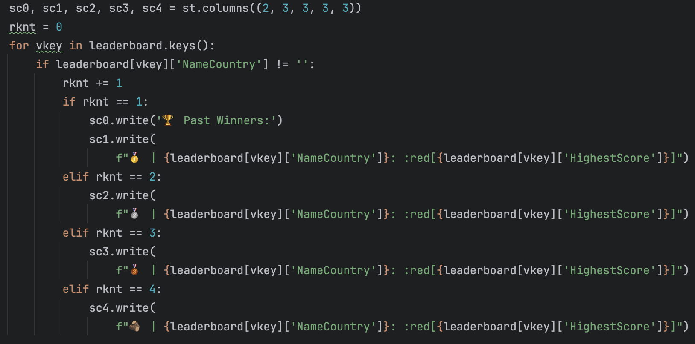

## Evidencia del cambio
> Ponga aquí evidencia con imágenes y fragmento de código

#### Archivo Json guarda 4 jugadores
 
#### Interfa gráfica muestra cuatro jugadores
 
#### Usuario pierde el juego cuando supera un máximo posible de fallos.
 
## Encuesta de la experiencia
Por favor, responde las siguientes preguntas basadas en tu experiencia modificando el código para incluir cuatro personas en el leaderboard en lugar de tres.
 -Para uncluir 4 personas en vez de 3 no fue complicado ya que solo era agregar una columna que mostrara al cuarto jugador, ya que el programa tenia ya la opcion para guardar a las 4 personas con el ountaje mas alto, lo unico necesario era lo que mencione anteriormente, agregar una columna en la cual mostrara al 4 jugador.
 -Para agregar que el juego se perdiera, tuve varias dificultades, no pude hacer que la persona perdiera o se acabara al fallar el 50% de las veces, sin embargo logre hacer que apareciera un mensaje diciendo que el juego finalizo solo con equivocarse, sin embargo el juego no finaliza. 

**Nombre:**

#### 1. ¿Cuánto tiempo te llevó entender las secciones del código relacionada con el leaderboard?
- [ ] Menos de 10 minutos
- [ ] Entre 10 y 30 minutos
- [✓] Entre 30 minutos y 1 hora
- [ ] Más de 1 hora

#### 2. ¿Cuánto tiempo te llevó entender las secciones del código relacionada con hacer que el usuario pierda si supera x cantidad de turnos?
- [ ] Menos de 10 minutos
- [ ] Entre 10 y 30 minutos
- [ ] Entre 30 minutos y 1 hora
- [✓] Más de 1 hora

#### 3. ¿Consideras que estaba documentada la lógica en el código para facilitar el cambio?
- [ ] Sí
- [✓] No

#### 4. ¿Te pareció fácil identificar dónde y qué cambios realizar para aumentar el número de personas en el leaderboard de 3 a 4?
- [✓] Muy fácil
- [ ] Algo fácil
- [ ] Algo difícil
- [ ] Muy difícil

#### 5. ¿Te pareció fácil identificar dónde y qué cambios realizar para agregar la lógica de perder el juego?
- [ ] Muy fácil
- [ ] Algo fácil
- [✓] Algo difícil
- [ ] Muy difícil

#### 5. ¿Qué tan seguro te sientes de que tus cambios no introdujeron errores en otras áreas del código?
- [ ] Muy seguro
- [ ] Moderadamente seguro
- [✓] Poco seguro
- [ ] Nada seguro

#### 6. Después de realizar los cambios, ¿cuánto tiempo te tomó verificar que el cambio funcionó como se esperaba?
- [ ] Menos de 10 minutos
- [ ] Entre 10 y 30 minutos
- [ ] Entre 30 minutos y 1 hora
- [✓] Más de 1 hora

#### 7. ¿Qué estrategia usaste para verificar que no habían problemas en el código fuente?
Para verificar que no tenia errores en el codigo fuente ejecutaba el programa y lo usaba, si no corria corregia el codigo para que corriera normalmente
#### 8. ¿Te enfrentaste a algún problema mientras intentabas realizar los cambios? Si es así, ¿cómo lo resolviste?
- [ ] No enfrenté problemas
- [ ] Revisé la documentación del código
- [ ] Busqué ayuda de un compañero o en línea
- [✓] Otro (especificar)
 -intente solucionar el problema mediante chatgpt, sin embargo la ayuda que tuve fue poca y nada, queria acudir a un compañero, sin embargo no tengo amigos con la confiza suficiente para que me ayuden, pense en escribirle al profesor, pero debido al dia que me puse a hacer el trabajo no lo hice y el codigo no tenia la documentacion suficiente.
